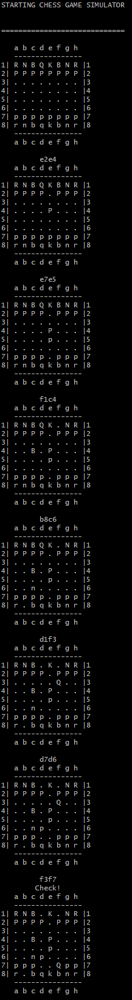

# Chess Simulator Application

The Chess Simulator is an application that simulates 2 players in a game of chess. The moves are read from a file and after each move it displays the state of the board in the terminal window.

## Run application
The artifact is stored in a project root: "chesssimulator-0.0.1-SNAPSHOT.jar"

In order to execute this jar open command line and run following command:


```java -jar "..\0.0.1-SNAPSHOT\chesssimulator-0.0.1-SNAPSHOT.jar" "..\moves.txt"```

Provide the absolute path for both jar and txt files.

Once file started you should see the game progress in your terminal as following: 

